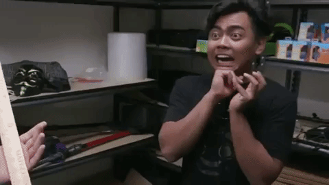

# Diabetes Supplies Project

This project is aimed to complete the OraclProduction Project, which can be found at www.oracle.com/academy.

The files contained in this repository are used for grading purposes in the COP 3003 class of the fall semester 2018.
The programming language used is **Java**.
The project is subdivided in multiple sections. The level of completion will be displayed under the **Level of Completion** section of this README.

## Project Description

OraclProduction Ltd are specialists in producing production line manufacturing plants. They could be asked to create a production plant for any type of product ranging from a simple packaging system to a variety of electronic devices. Recently they have been asked to create a production line for multimedia devices which include music and movie players. They wish to employee you to design a template in Java for creating and recording all future production line items. For this particular production facility you will only implement a concrete class for music and movie players.Your task is to create a flexible structure that could be used in any production line. This structure would then allow easy modification to handle different products.

##TODO:
- [ ] Add invalid username when trying to delete a user

##Bugs

## Built With

* [IntelliJ IDEA](https://www.jetbrains.com/idea/) - IDE of choice
* [SceneBuilder](https://gluonhq.com/products/scene-builder) - Great software to create GUI screens with ease

## Plugins Used
* [FindBugs](http://findbugs.sourceforge.net/)
* [CheckStyle](http://checkstyle.sourceforge.net/config_naming.html#PackageName) - Google Checks used

## Authors

* **Luca Missaglia** - *Project Developer* - [Lollators](https://github.com/Lollators)

## License

This project is licensed under the MIT License - see the [LICENSE.md](LICENSE.md) file for details
